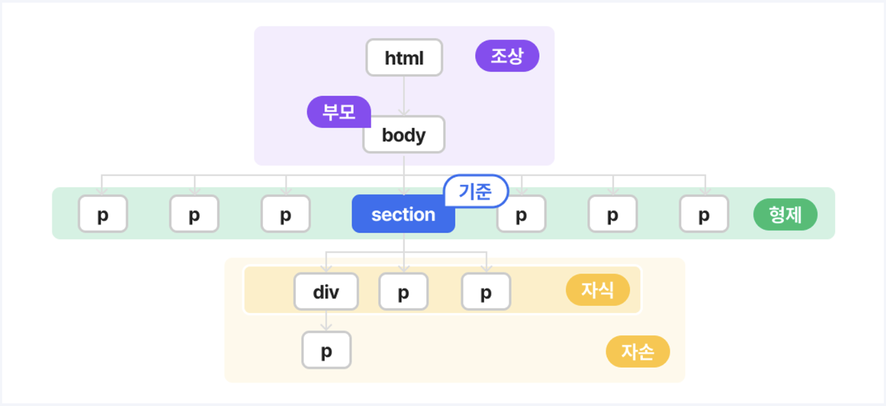
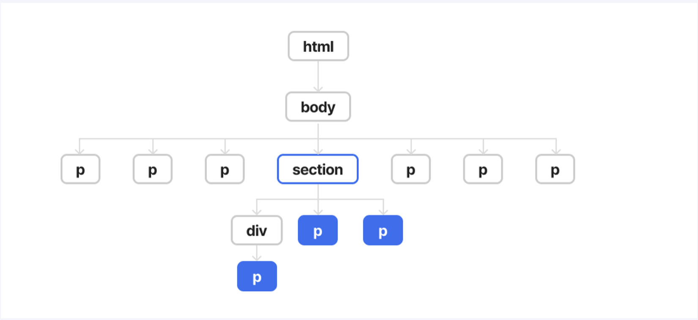
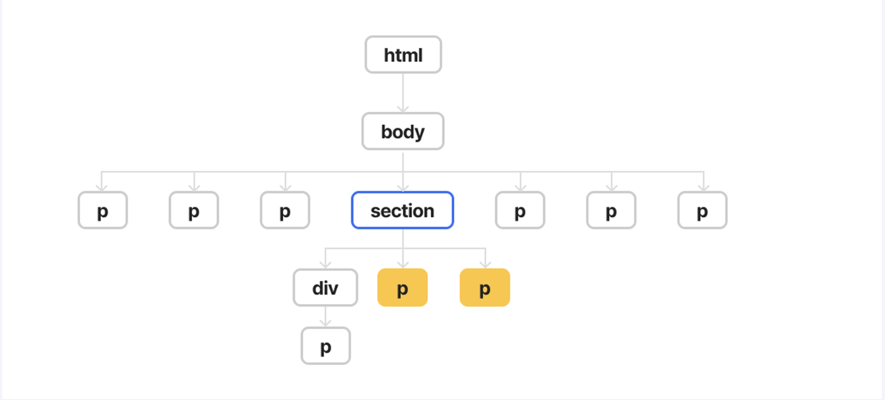
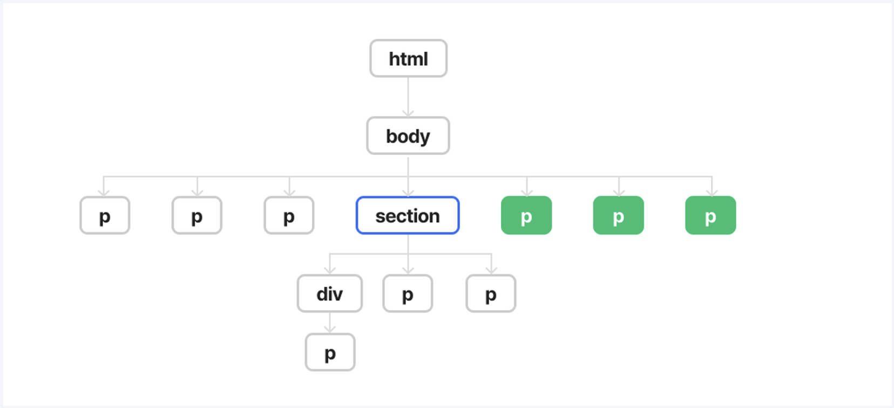
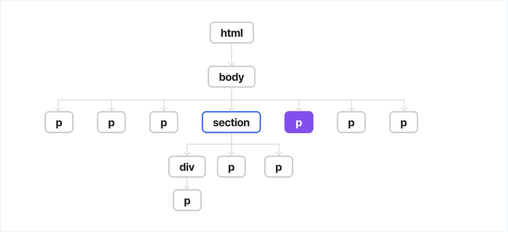
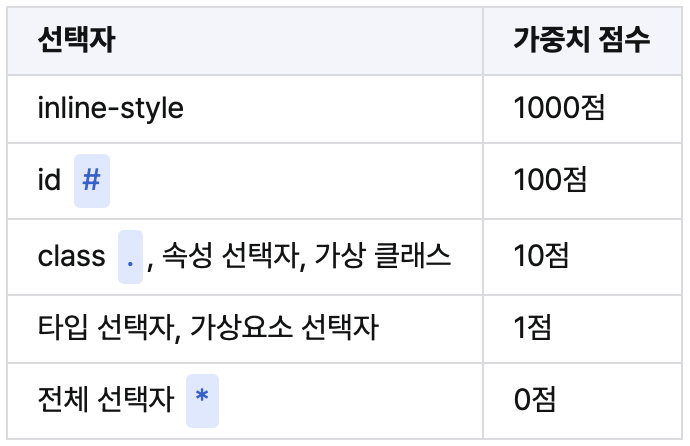

# CSS 복습

## 상속(inheritance)

CSS상속은 부모요소에 적용된 스타일 속성이 자식요소에게 전달되는 방식을 말합니다.
부모 요소의 속성을 상속받고, 자식 요소에게도 해당 속성을 상속합니다.
상속의 장점으로는 디자인의 일관성을 유지하고, 코드의 중복을 줄일 수 있습니다.

상속이 되는 속성 : 텍스트관련 속성 (font-size/font-weight/color/font-family..)
상속이 되지 않는 속성 : 레이아웃 관련 속성 (border/width/height/margin/padding..)

상속은 직접 명시한 스타일속성보다 우선순위가 낮습니다.
상속보다 직접 명시한 스타일속성이 자식요소에게 내려갑니다.

## 상속 제어

상속을 제어할 수 있는 여러 속성 값이 있습니다.
- inherit : 상속되지 않는 속성을 강제로 상속받게 합니다.
사용방법 : 선택한 요소에 적용된 속성값을 부모와 동일하게 상속받게 합니다.
```html
<section>
    <h2></h2>
</section>
```
```css
section {
    border: 1px solid salmon;
}
h2 {
    border: inherit;
}
```
- initial : 요소의 모든 속성을 각 속성의 초기값으로 변경합니다.(*브라우저 기본값*)
- unset : 상속되는 속성이면 inherit처럼, 아니라면 initial처럼 작동합니다.
- revert : 스타일 규칙이 없었을 때 상태로 복구합니다. (*상위 css*)

## 복합 선택자



1. 자손 선택자 ( )

2. 자식 선택자 (>)

3. 일반 형제 선택자 (~)

4. 인접 형제 선택자 (+)


## 선택자 우선순위 

CSS 선택자 우선순위는 크게 세 가지 원칙을 따릅니다.
1. 후자 우선의 원칙
2. 구체성(명시도)의 원칙
3. 중요성의 원칙

1. 후자 우선의 원칙 
-  동일한 요소에 여러가지의 속성값이 적용되면 가장 마지막에 적용된 스타일을 따릅니다.
2. 구체성(명시도)의 원칙 
- 얼마나 구체적으로 명시되어있는지에 따라 우선순위가 결정됩니다.
- 구체성은 다음과 같은 가중치로 계산됩니다.

또하나! 유형 선택자가 +된 것이 점수가 더 높다하더라도 상위 클래스나 아이디 선택자보다 우선될 수 없습니다. 마치 은메달이 아무리 많아도 금메달 1개를 이길 수 없는 것과 같습니다.

3. 중요성의 원칙
- !important 선언은 다른 모든 선언보다 우선됩니다.
- 남용하면 CSS의 예측가능성과 유지보수성을 해칠 수 있습니다.

## 스타일의 우선순위

1. 중요성의 원칙
2. 구체성의 원칙
3. 후자 우선의 원칙
CS에서 스타일이 충돌될 때 위 순서를 따릅니다. 